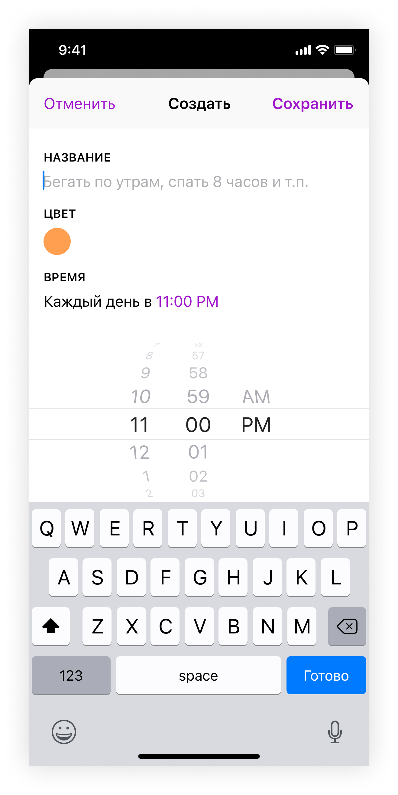
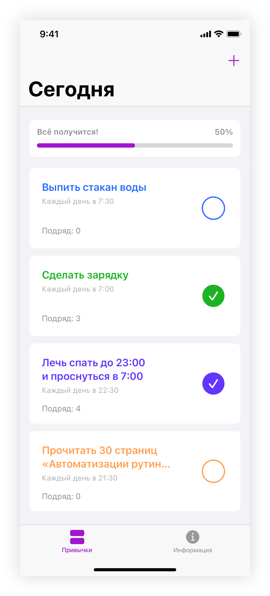
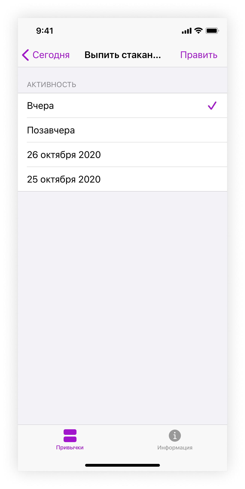

  

  # MyHabits
## Трекер полезных привычек

- Адаптивная верстка экранов;

- Различные навигационные паттерны в iOS;

- Использование и настройка визуальных компонентов;

- Использование UITableView, UICollectionView и кастомных ячеек.
     
  

  
### Работа с дизайном

   

### Загрузочный экран приложения - Splash Screen

   

### Экран с информацией - InfoViewController

   

      
   

   
### Добавление новой привычки - HabitViewController

   

      
   

### Список добавленных привычек - HabitsViewController

  

     
  

  
### Показ данных о выбранной привычке

   

      
   

### Редактирование и удаление добавленной привычки

   

      
   

